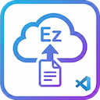
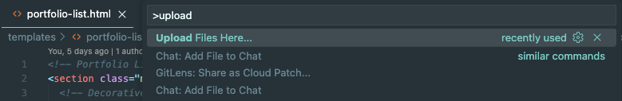
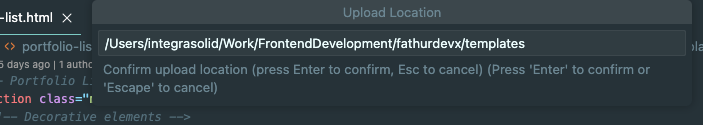
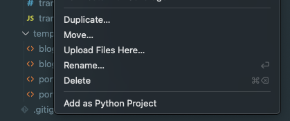

# EZ File Upload for VS Code

<p align="center">
  
</p>

A simple VS Code extension that adds "Upload Files Here..." to the Explorer context menu, allowing you to easily copy files from anywhere on your system into your workspace folders.

**Compatible with VS Code, Cursor, and Antigravity editors.**

## Features

- **Command Palette Access**: Invoke from Command Palette (Cmd+Shift+P / Ctrl+Shift+P) with smart destination detection
- **Context Menu Integration**: Right-click any folder in the Explorer to upload files directly
- **Smart Upload Confirmation**:
  - **Context Menu**: Direct upload to selected folder (no confirmation by default)
  - **Command Palette**: Always shows location confirmation
  - **Configurable**: Enable confirmation for context menu via settings
- **Multi-file Selection**: Select and upload multiple files at once
- **Smart Destination Detection**: When using Command Palette, automatically uploads to:
  - Active file's parent directory (if a file is open)
  - Workspace root folder (if no file is open)
- **Smart Environment Detection**: Automatically uses the right file picker for your environment
  - **Local Workspaces**: Native OS file picker dialog
  - **Remote Workspaces**: Webview-based picker to browse your local machine's files
- **Progress Tracking**: Real-time progress notifications during upload
- **Conflict Resolution**: Automatically prompts when files already exist (Overwrite/Skip)
- **Cancellable Operations**: Cancel uploads in progress (local workspaces)
- **Remote Workspace Support**: Full support for GitHub Codespaces, SSH, WSL, Dev Containers, Cursor, and Antigravity

## Screenshots

### Command Palette Access


### Upload Location Confirmation


### Context Menu Integration


## Usage

### From Command Palette
1. Open Command Palette (Cmd+Shift+P / Ctrl+Shift+P)
2. Type "Upload Files Here..." and select the command
3. Files will be uploaded to:
   - The parent directory of your currently open file (if you have a file open)
   - The workspace root folder (if no file is open)
4. Confirm the upload location (press Enter to confirm, or edit the path, or Esc to cancel)
5. Choose files and follow the same process as context menu usage below

### From Explorer Context Menu (Local Workspaces)
1. Right-click any folder in the VS Code Explorer
2. Select "Upload Files Here..." from the context menu
3. Choose one or more files from the native OS file picker dialog (no confirmation needed)
4. Monitor progress in the notification
5. If a file already exists, choose to Overwrite or Skip

### From Explorer Context Menu (Remote Workspaces)
1. Right-click any folder in the VS Code Explorer
2. Select "Upload Files Here..." from the context menu
3. A webview panel opens with "Browse Files..." button (no confirmation needed)
4. Click "Browse Files..." to open your local machine's file picker
5. Select one or more files from your local computer
6. Review the file list with sizes in the webview
7. Click "Upload Selected Files"
8. If a file already exists, choose to Overwrite or Skip
9. The webview closes automatically upon successful upload

## Installation

### From VSIX
1. Download the `.vsix` file
2. In VS Code, open Extensions (Cmd+Shift+X / Ctrl+Shift+X)
3. Click the "..." menu → "Install from VSIX..."
4. Select the downloaded `.vsix` file

### From Source
```bash
git clone <repository-url>
cd ez-file-upload
npm install
npm run compile
```

Press F5 to launch the Extension Development Host for testing.

## Building

```bash
# Compile TypeScript
npm run compile

# Package as VSIX
npx @vscode/vsce package
```

## Configuration

### Settings

- **`ez-file-upload.confirmContextMenuUpload`** (default: `false`)
  - When disabled (default): Context menu "Upload Files Here..." uploads directly to the selected folder
  - When enabled: Shows confirmation dialog before file selection, even for context menu
  - Command Palette uploads always show confirmation regardless of this setting

To enable confirmation for context menu:
1. Open Settings (Cmd+, / Ctrl+,)
2. Search for "EZ File Upload"
3. Enable "Confirm Context Menu Upload"

## Requirements

- VS Code version 1.85.0 or higher

## Development

### Architecture

The extension intelligently adapts to different VS Code environments:

**Local Workspaces:**
- Uses `vscode.window.showOpenDialog()` for native OS file picker
- Files copied using `vscode.workspace.fs.copy()`

**Remote Workspaces:**
- Detects remote environment via `vscode.env.remoteName`
- Opens a webview panel with HTML5 `<input type="file">` element
- Files read as `ArrayBuffer` in the webview's JavaScript context
- Data transferred to extension via `postMessage()`
- Files written using `vscode.workspace.fs.writeFile()`

This approach ensures that file selection always happens on the local machine, even when the editor is connected to:
- GitHub Codespaces
- Remote SSH workspaces
- WSL (Windows Subsystem for Linux)
- Dev Containers
- Cursor editor
- Antigravity editor
- Any remote environment where `vscode.env.remoteName` is defined

## License

See LICENSE file for details.
